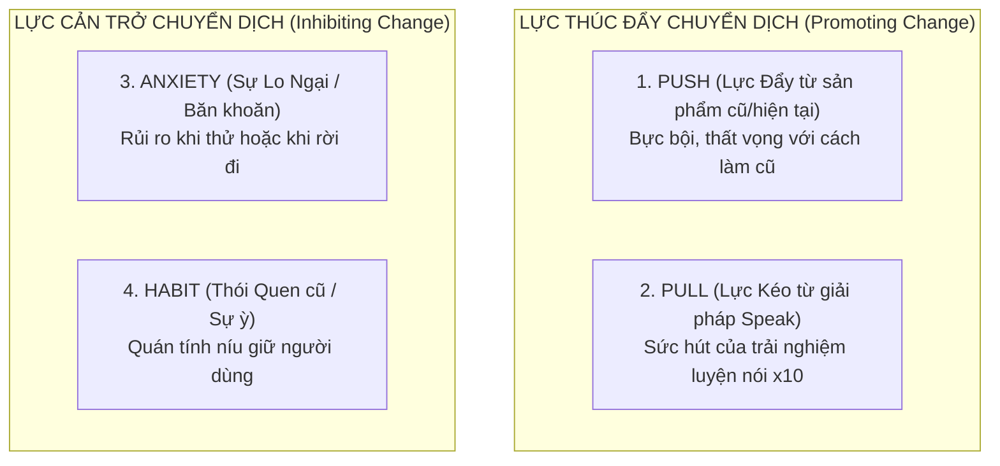
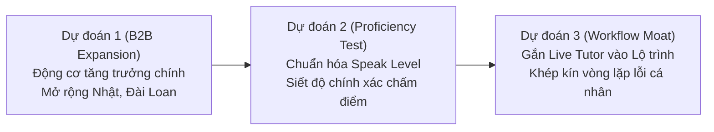

# Day 16 — Case Study Sản Phẩm AI: Speak (Language Learning)

- **Học viên:** Cao Đức Hiệp
- **Mã học viên (MHV):** 2A202602550
- **Track:** Track 1 — AI Product Discovery & Product Decision
- **Sản phẩm phân tích:** Speak (AI Language Learning App)

---

## Step 1 — Dựng Timeline & Revert Nguyên Lý (Checkpointed CP1)

> **Mục tiêu:** Đọc sản phẩm như đọc chuỗi quyết định chiến lược (Product Decisions: tính năng lớn, pivot, đổi pricing, đổi segment, xây moat), không phải đọc changelog sửa lỗi.

### 1. Bảng Timeline 8 Quyết Định Sản Phẩm Lớn Nhất

| Thời điểm | Cập nhật (Quyết định sản phẩm) | Context lúc đó | Nguyên lý cốt lõi |
|---|---|---|---|
| **2019** | **Ra mắt tại Hàn Quốc:** Ưu tiên nói thành tiếng, học theo mẫu câu rồi lặp lại thay vì học thuộc từ vựng/ngữ pháp. Trọng tâm: cho user nói thành tiếng càng nhiều càng tốt.  🔗 [TechCrunch 6/2024](https://techcrunch.com/2024/06/20/language-learning-app-speak-nets-20m-doubles-valuation/?rand=23331) | Thị trường học ngoại ngữ chủ yếu làm bài tập ngữ pháp/trắc nghiệm (Duolingo đời đầu). Chưa có LLM; ít người tin AI giao tiếp được. Bản 2017 mới nhận diện giọng nước ngoài, chưa hội thoại trọn vẹn.  🔗 [Forbes](https://www.forbes.com/sites/rashishrivastava/2025/11/12/this-startup-is-racing-duolingo-to-replace-human-language-tutors-with-ai/) | **Định nghĩa "tốt" & Vertical AI:**  - Định nghĩa lại "học tốt ngoại ngữ" = phản xạ nói thành tiếng được, không phải nhớ nhiều từ vựng. - Vertical AI: kết hợp mô hình nhận diện giọng nói ngách + phương pháp lặp mẫu câu (drilling). |
| **11/2022** | **Ra mắt AI Tutor hội thoại mở:** Nói chuyện tự do theo chủ đề, phản hồi phát âm, ngữ pháp, từ vựng theo thời gian thực. Nhận vốn từ OpenAI Startup Fund.  🔗 [TechCrunch 11/2022](https://techcrunch.com/2022/11/17/speak-lands-investment-from-openai-to-expand-its-language-learning-platform/) | Thời điểm ngay trước khi ChatGPT ra mắt 2 tuần (GPT-3). Cả ngành EdTech đang loay hoay với kịch bản đóng (rule-based chatbot). Vốn đi kèm quyền truy cập sớm hạ tầng OpenAI & Azure. | **x10 Value Proposition:**  - Bước nhảy vọt 10x từ luyện theo kịch bản cứng nhắc sang hội thoại mở không giới hạn. - Đưa trải nghiệm gần với gia sư người hơn hẳn 1 bậc với chi phí cực thấp. |
| **14/03/2023** | **Nâng cấp AI Tutor lên GPT-4:** Cá nhân hóa phản hồi ngữ pháp và phát âm theo ngữ cảnh sâu của người học.  🔗 [Speak Blog (GPT-4)](https://www.speak.com/blog/speak-gpt-4) | GPT-4 chính thức ra mắt. Đối thủ lớn như Duolingo cũng công bố Duolingo Max (dùng GPT-4). Nguy cơ bị coi là "wrapper mỏng" nếu chỉ gọi API thông thường. Speak chạy GPT-4 trước công chúng 2 tháng nhờ quỹ OpenAI. | **Wrapper vs. Moat:**  - Đối thủ đều có thể mua GPT-4, do đó công nghệ model không còn là moat độc quyền. - Moat nằm ở cách nhúng sâu phản hồi vào lộ trình bài học (pedagogical UX) và prompt logic chuyên sâu cho ngôn ngữ. |
| **2023 – 2024** | **Mở rộng quốc tế (Nhật Bản, Đài Loan) & Siêu địa phương hóa (Hyper-localization):** Tối ưu bộ giải thích lỗi bằng tiếng mẹ đẻ của thị trường mục tiêu (nhanh hơn 2,8 lần ở Nhật).  🔗 [Speak Blog (Series B-2)](https://www.speak.com/blog/series-b-2) | Trước đó chỉ tập trung riêng ở Hàn Quốc. Mở rộng quốc tế thường gặp rào cản văn hóa và sự e ngại nói tiếng Anh khác nhau ở từng nước Á Đông. | **Vertical AI & Domain Expertise:**  - Thấu hiểu "pain point" và thói quen phát âm đặc thù của người học từng nước (ví dụ: người Nhật hay e ngại và gặp lỗi âm tiết tiếng Anh đặc thù). - AI đóng vai trò gia sư bản địa hóa, không dùng chung 1 kịch bản toàn cầu. |
| **H2/2024** | **Ra mắt Speak for Business (Pivot sang B2B Enterprise):** Cung cấp giải pháp đào tạo ngoại ngữ cho doanh nghiệp với cổng quản trị (Admin Portal) theo dõi tiến độ nhân viên.  🔗 [Speak B2B](https://www.speak.com/b2b) | Tăng trưởng B2C bắt đầu chạm ngưỡng CAC cao tại các thị trường cũ; công ty có ~75 nhân sự; doanh nghiệp cần giải pháp nâng cao kỹ năng giao tiếp tiếng Anh toàn cầu cho nhân sự. Đạt >200 doanh nghiệp với tỷ lệ sử dụng 85%. | **Moat từ Workflow & Đổi Segment:**  - Mở rộng từ B2C sang B2B giúp tạo nguồn doanh thu định kỳ (recurring revenue) ổn định. - Tạo switching cost cao nhờ tích hợp vào quy trình đào tạo và đo lường KPI nhân sự của tổ chức. |
| **2024 (T6 & T12)** | **Chiến lược Đa ngôn ngữ (Tây Ban Nha, Pháp) & Tự huấn luyện Voice Model:** Nhận diện giọng nói bằng model riêng tự train trên dữ liệu nội bộ. Gọi vốn Series C 78 triệu USD (định giá 1 tỷ USD).  🔗 [TechCrunch 12/2024](https://techcrunch.com/2024/12/10/openai-backed-speak-raises-78m-at-1b-valuation-to-help-users-learn-languages-by-talking-out-loud) | Nhu cầu học tiếng Tây Ban Nha rất lớn tại Mỹ. Chi phí và độ trễ khi phụ thuộc hoàn toàn vào Whisper/OpenAI đòi hỏi giải pháp tối ưu hơn. Định giá công ty tăng gấp đôi từ 500M lên 1B USD trong 6 tháng. | **Data Flywheel & Xây dựng Proprietary Moat:**  - Moat vững chắc nhất không đến từ LLM đi thuê mà từ **mô hình nhận diện giọng nói độc quyền** được huấn luyện trên hàng triệu giờ phát âm lỗi của người học. - Chuyển dịch từ "AI Wrapper" thành "Deep-tech AI Application". |
| **10/12/2025** | **Winter Release: Vòng lặp thích ứng (Adaptive Learning Loop) & Chuẩn hóa Speak Level:** Cấu trúc bài học theo chu trình `Learn -> Practice -> Apply`, ra mắt thước đo Speak Level cùng cơ chế duy trì thói quen (streak freeze/repair).  🔗 [Speak Blog (Winter 2025)](https://www.speak.com/blog/winter-2025) | Thâm nhập thị trường Mỹ đối đầu trực diện Duolingo. Các ứng dụng voice AI đa dụng (generic voice assistants) tràn ngập thị trường. Người dùng cần một lộ trình bài bản thay vì chỉ "nói chuyện phiếm với bot". | **Vòng Lặp Học (Learning Loop) & Định Nghĩa "Tốt":**  - Khép kín vòng lặp: Tiếp nhận kiến thức $\rightarrow$ Luyện phản xạ $\rightarrow$ Ứng dụng thực tế. - "Speak Level" định lượng hóa sự tiến bộ thành thước đo cụ thể, giúp học viên nhận thấy giá trị thực tế sau mỗi buổi học. |
| **~10/9/2026** | **Live Tutor Lessons trên GPT-Live-1 (Full-duplex Realtime Voice):** Gia sư lắng nghe thời gian thực, cho phép người dùng ngắt lời, hỏi chen ngang tức thì không có độ trễ.  🔗 [X của Speak](https://x.com/speak/status/2098095986606551481) | OpenAI ra mắt GPT-Live (mô hình nghe-nói cùng lúc) vào tháng 7/2026, mở API tháng 9/2026. Các ông lớn (Microsoft, xAI) đều chạy đua voice song công. Ranh giới giữa gia sư AI và người thật gần như bị xóa nhòa. | **x10 Tự nhiên hội thoại & Câu hỏi Moat:**  - Tạo trải nghiệm hội thoại thời gian thực mượt mà x10 (zero-latency, interruptible). - Tái khẳng định câu hỏi chiến lược: Khi model nền tảng ai cũng thuê được, moat của Speak nằm ở **ngữ cảnh sư phạm, dữ liệu người học và thói quen người dùng**. |

---

### 2. Phản Biện & Nghiệm Thu Checkpoint CP1

#### ❓ Câu hỏi 1: Vì sao chọn 8 cột mốc này mà không phải các mốc khác?
> **Trả lời:** Cả 8 cột mốc được chọn đều đại diện cho một **Quyết định Sản phẩm chiến lược (Product Decision)** then chốt làm thay đổi căn bản 1 trong 4 yếu tố:
> 1. **Value Proposition (Giá trị cốt lõi):** Chuyển từ học lặp kịch bản sang hội thoại mở (11/2022) và hội thoại song công ngắt lời tự nhiên (2026).
> 2. **Product Defensibility (Xây dựng Moat):** Tự train model nhận diện giọng nói độc quyền thay vì làm wrapper phụ thuộc hoàn toàn vào OpenAI (2024).
> 3. **Segment & Business Model:** Mở rộng từ B2C cá nhân sang B2B doanh nghiệp (H2/2024) và mở rộng đa thị trường/đa ngôn ngữ (2023–2024).
> 4. **Learning Framework:** Định lượng hóa giá trị học tập thông qua Speak Level và chu trình Learn-Practice-Apply (2025).

#### ❓ Câu hỏi 2: Đâu là cột mốc đã cân nhắc rồi loại ra? Vì sao nó không đủ tư cách là "quyết định sản phẩm"?
> **Trả lời:** Nhóm đã cân nhắc và chủ động loại bỏ các mốc sau:
> 1. *Các bản cập nhật giao diện (UI redesign, dark mode, widget màn hình khóa):* Đây là các cải tiến vận hành/thẩm mỹ thông thường (cosmetic updates), không làm thay đổi cách người học tương tác với AI hay giải quyết pain point cốt lõi.
> 2. *Các chiến dịch khuyến mãi / giảm giá mùa tựu trường (Back to school discount):* Đây là quyết định Marketing/Sales ngắn hạn, không làm thay đổi định giá (pricing strategy) hay cấu trúc gói dịch vụ lâu dài.
> 3. *Các bản vá lỗi nhận diện giọng nói (Minor bug fixes/patch release):* Đây là bảo trì kỹ thuật thường nhật, không tạo ra một bước nhảy vọt x10 về trải nghiệm sản phẩm.

---

## Step 2 — Phân tích Người Dùng & 4 Forces (Checkpointed CP2)

> **Mục tiêu:** Thấu hiểu sự dịch chuyển của tệp người dùng theo thời gian, bóc tách động lực chuyển đổi (Switching Dynamics) qua mô hình 4 Forces của JTBD, và kiểm chứng bằng các tín hiệu thực tế từ review người dùng.

### 1. Bảng So Sánh Early Adopters và Tệp Hiện Tại

| Tệp người dùng | Đặc điểm nhân khẩu & Hành vi | JTBD (Jobs-to-be-done) | Cách cũ họ từng dùng | Cột mốc gây dịch chuyển (Step 1) |
|---|---|---|---|---|
| **Early Adopters (2019 – 2022):**  Người đi làm tại Seoul, Hàn Quốc | - Độ tuổi: ~25–40 tuổi *(suy luận từ bối cảnh kinh tế & nhu cầu công việc)*. - Nền tảng: Đã học tiếng Anh nhiều năm theo hướng thi cử (TOEIC/CSAT); đọc hiểu và ngữ pháp khá nhưng "câm" khi giao tiếp. - Khá giả, sẵn sàng chi trả cho giáo dục. - Tâm lý: Sợ sai, sợ bị phán xét trước người khác. | *"Khi tôi có nền tảng ngữ pháp nhưng bị đơ/đóng băng khi phải nói, tôi muốn được nói thành tiếng mỗi ngày và được sửa lỗi ngay lập tức mà không sợ bị phán xét, để khi giao tiếp với người thật tôi không còn cảm giác sợ hãi."* | - Đi học trung tâm ngữ pháp/luyện thi. - Học gia sư người thật 1:1 (chi phí rất đắt đỏ, khó sắp xếp lịch, áp lực tâm lý e ngại). - Tự học thụ động qua sách/video (thiếu môi trường phản hồi tức thì). | **2019** (Chọn *"Nói thành tiếng"* làm định nghĩa "học tốt") và **11/2022** (Chuyển sang hội thoại mở với AI Tutor). |
| **Tệp Hiện Tại A (H2/2024 – nay):**  Nhân viên doanh nghiệp (B2B Enterprise tại Hàn, Nhật, Đài Loan) | - Nhân viên tại các tập đoàn lớn (KPMG, HD Hyundai, >200 doanh nghiệp B2B). - Được công ty tài trợ 100% học phí như một phúc lợi đào tạo. - Cần tiếng Anh thực chiến cho công việc, họp quốc tế, giao dịch đối tác nhưng quỹ thời gian eo hẹp. | *"Khi công việc đòi hỏi giao tiếp tiếng Anh toàn cầu mà tôi không có thời gian tìm gia sư, tôi muốn một lộ trình luyện nói do công ty chi trả và theo dõi được, để tôi tiến bộ trong công việc mà không phải tự bỏ tiền hay tự loay hoay sắp xếp."* | - Tự bỏ tiền túi mua app lẻ hoặc tự học. - Tham gia các lớp đào tạo nội bộ cứng nhắc của công ty. - Bỏ mặc, không luyện tập vì thiếu động lực cá nhân. | **H2/2024 (Speak for Business):**  Dịch chuyển từ B2C sang B2B; bổ sung cổng quản trị Admin Portal theo dõi tiến độ nhân viên. |
| **Tệp Hiện Tại B (2024 – 2026):**  Người nói tiếng Anh tại Mỹ học tiếng Tây Ban Nha / Pháp | - Người dùng học ngoại ngữ trên app nhiều năm (đặc biệt là tệp người dùng cũ của Duolingo). - Trình độ mới bắt đầu (Beginner) hoặc Sơ trung cấp (Intermediate). - Gặp hiện tượng "Duolingo burnout": Giữ streak nhiều năm, nhớ từ vựng nhưng không ghép thành câu nói hoàn chỉnh được. | *"Khi tôi đã học app ngoại ngữ nhiều năm, nhận biết được mặt chữ nhưng vẫn không thể tự nói nổi một câu trọn vẹn, tôi muốn một lộ trình ép tôi phải mở miệng nói ngay từ ngày đầu, để lần tới gặp người bản xứ tôi có thể tự tin trò chuyện."* | - Duolingo (làm bài tập trắc nghiệm, duy trì streak nhưng thụ động). - ChatGPT Voice miễn phí (nói chuyện tự do nhưng thiếu giáo trình sư phạm, dễ bị lặp lại). | **2024** (Mở rộng tiếng Tây Ban Nha, Pháp với Voice Model riêng) và **12/2025** (Winter Release: Speak Level + cơ chế Streak để giữ chân người học). |

---

### 2. Phân Tích Mô Hình 4 Forces (Động Lực Chuyển Đổi JTBD)

| Lực (Force) | Tác động lên người học Speak | Bằng chứng thực tế & Tín hiệu thu thập | Đánh giá mức độ |
|---|---|---|---|
| **1. PUSH (Đẩy)** *(Bực bội thúc đẩy rời bỏ hoặc bức xúc với Speak)* | - **Đẩy khỏi sản phẩm cũ (Duolingo/Lớp học):** Học nhiều năm vẫn không nói được; áp lực tâm lý khi đối thoại với giáo viên người thật. - **Đẩy phát sinh từ chính Speak (Điểm nghẽn):**    + Độ tin cậy chấm điểm 2 chiều: Chấm quá khắt khe ở âm tiết ngắn (như *"how's"* nói cả tỉ lần vẫn fail) hoặc quá dễ dãi ở câu dài.   + Ở trình độ cao nội dung bị lặp lại, bài học và hội thoại tự do chưa liên kết chặt chẽ. | - Review người dùng: *"Học Duolingo 5 năm không nói được tiếng Pháp"*; *"Đọc từ 'how's' cả tỷ lần app vẫn không cho qua dù Google Assistant nhận đúng 100%"*. - Nhiều review chỉ ra học viên trình độ cao không chọn được accent hay giọng AI phù hợp. | **Cao** *(tăng mạnh theo thời gian sử dụng và trình độ học viên)* |
| **2. PULL (Kéo)** *(Sức hấp dẫn đưa user đến với Speak)* | - Trải nghiệm **"ép nói từ ngày đầu"**: Nói thành tiếng 20–30 câu mỗi bài trong không gian an toàn tuyệt đối, không sợ bị phán xét. - Phản hồi sửa lỗi phát âm và ngữ pháp tức thì theo thời gian thực. - Gia sư AI full-duplex có thể ngắt lời tự nhiên như người thật (GPT-Live). | - Người dùng đạt hàng trăm lượt phát âm chỉ trong 15 phút học. - Vốn đầu tư từ OpenAI Startup Fund giúp Speak ứng dụng model giọng nói và LLM nhanh hơn thị trường 2–3 tháng. | **Rất mạnh** *(đây là giá trị cốt lõi giữ chân khách hàng)* |
| **3. ANXIETY (Lo ngại)** *(Rào cản tâm lý khi chuyển đổi)* | - **Lo ngại khi bắt đầu (Onboarding/Trial):** Nỗi sợ bị trừ tiền tự động không rõ ràng; giá hiển thị khuyến mãi khác giá trừ thực tế; thủ tục hủy trial trước 24h gây ức chế. - **Lo ngại khi rời đi:** Sợ mất lộ trình bài bản có cấu trúc, mất lịch sử tích lũy (Speak Level); lo công cụ miễn phí như ChatGPT Voice không có bài tập dẫn dắt. | - Review Google Play (04/01/2026): Bị trừ 1.443.333 VNĐ thay vì 1.299.000 VNĐ niêm yết, lịch sử giao dịch không hiển thị rõ. - Nhiều người học ngần ngại đăng ký gói năm vì sợ sau vài tuần sẽ bỏ xó. | **Trung bình đến Cao** *(ma sát trial là rào cản lớn ở phễu đầu vào)* |
| **4. HABIT (Thói quen)** *(Sự ỳ níu giữ ở lại)* | - **Ở B2C (Cá nhân):** Thói quen tương đối yếu. Người dùng chỉ thấy đáng tiền ở những tháng mở app luyện tập liên tục hàng ngày; dễ bị đứt chuỗi thói quen nếu bận rộn. - **Ở B2B (Doanh nghiệp):** Rất cao vì công ty tài trợ và gắn với KPI đào tạo nội bộ. | - Review người dùng Hàn Quốc: *"Chỉ thấy đáng tiền ở tháng dùng gần như mỗi ngày"*. Đến cuối 2025 Speak mới phải bổ sung Streak Freeze và Streak Repair để xây dựng thói quen tương tự Duolingo. | - **B2C: Thấp đến Trung bình** - **B2B: Rất cao** |

---

### 3. Tín Hiệu Thực Tế Từ Review 1–2 Sao (Empirical Signals)

Để tránh thiên lệch từ các bài PR hoặc trang review nội bộ của Speak, phân tích đã đối chiếu thêm các review tiêu cực (1 sao) thực tế từ người dùng trên Store:

| Ngày review | Nội dung phản ánh từ người dùng | Nhóm vấn đề | Tác động lên bài toán sản phẩm |
|---|---|---|---|
| **23/07/2026** | Người dùng đọc đúng chuẩn (kể cả dùng Google đọc lại y hệt) nhưng app liên tục chấm sai và báo lỗi phát âm. | **Chấm phát âm sai lệch (Quá khắt khe)** | Làm hỏng lời hứa giá trị cốt lõi (Core Value Proposition): Người dùng mất niềm tin vào độ chính xác của AI Tutor. |
| **01/08/2026** | Luyện phát âm từ *"how's"* lặp lại vô số lần vẫn không qua được bài, gây ức chế tột độ và khuyên người khác đừng tải. | **Lỗi thiết kế bài học / Ngưỡng nhận diện âm ngắn** | Lỗ hổng trong mô hình nhận diện giọng nói đối với các từ co rút (contractions), tạo điểm nghẽn khiến vòng lặp học bị tắc. |
| **04/01/2026** | Bị trừ tiền tự động khi chưa xác nhận đăng ký gói chính thức, số tiền trừ (1.443.333 VNĐ) cao hơn giá niêm yết (1.299.000 VNĐ). | **Ma sát thanh toán & Trải nghiệm Free Trial** | Gia tăng lực **Anxiety (Lo ngại)** ngay tại cửa ngõ onboarding, khiến người dùng tiềm năng nghi ngờ sự minh bạch của ứng dụng. |

---

### 4. Trả Lời Câu Hỏi Phản Biện Checkpoint CP2

#### ❓ Câu hỏi 1: Lực nào đang giữ chân người dùng Speak mạnh nhất hiện tại?
> **Trả lời:** Lực giữ chân mạnh nhất hiện nay vẫn là **Lực Kéo (PULL)** — cụ thể là giá trị cốt lõi: *"Bị ép mở miệng nói thành tiếng theo lộ trình bài bản và được sửa sai ngay lập tức mà không bị phán xét"*.
> - Đây là lợi thế cạnh tranh về mặt giá trị trải nghiệm, chứ **chưa phải là sự khóa chặt (Lock-in/Moat) về thói quen hay dữ liệu**.
> - Đối với tệp B2B, lực giữ bổ sung là **Thói quen tổ chức (Organizational Switching Cost)**, vì nhân viên được công ty chi trả và gắn quyền lợi đào tạo nên họ ít có động lực đổi sang app khác.

#### ❓ Câu hỏi 2: Điều gì sẽ xảy ra nếu lực kéo này mất đi hoặc bị bào mòn?
> **Trả lời:** Lực kéo của Speak đang đối mặt với 2 nguy cơ bào mòn lớn:
> 1. *Sự phổ cập của Voice AI miễn phí:* Khi các mô hình nền tảng như ChatGPT Voice, GPT-Live hay Gemini Live đạt độ tự nhiên gần như người thật và hoàn toàn miễn phí, nhóm người dùng chỉ cần "một đối tác luyện nói tự do" sẽ rời bỏ Speak đầu tiên.
> 2. *Sự suy giảm niềm tin vào thuật toán chấm điểm:* Nếu Speak tiếp tục gặp lỗi chấm phát âm khắt khe vô lý (như các review 1 sao đã chỉ ra), người học sẽ mất niềm tin vào vai trò "người sửa lỗi" của AI và chuyển sang nói chuyện tự do trên ChatGPT Voice.
>
> $\rightarrow$ **Hệ quả chiến lược:** Đây chính là lý do giải thích vì sao từ cuối 2025, Speak buộc phải bổ sung **Speak Level**, **chu trình Learn-Practice-Apply** và **cơ chế Streak/Gamification**: Speak đang gấp rút chuyển dịch trọng tâm từ *Lực Kéo công nghệ đơn thuần* sang xây dựng **Lực Cản Lo Ngại (Anxiety - mất dữ liệu tiến trình)** và **Lực Thói Quen (Habit Loop)** để phòng thủ trước các mô hình nền tảng miễn phí.

---

## Step 3 — Ba Dự Đoán Sản Phẩm 6–12 Tháng & Phản Biện (Checkpointed CP3)

> **Mục tiêu:** Dự phóng chuỗi quyết định sản phẩm tiếp theo của Speak trong 6–12 tháng tới, dựa trên sự kết hợp giữa dòng thời gian chiến lược (Step 1), động lực người dùng 4 Forces & phản ánh thực tế (Step 2), và các tín hiệu tuyển dụng/vận hành hiện tại.

### 1. Ba Dự Đoán Chiến Lược (6–12 Tháng Tới)

#### 🎯 Dự đoán 1: Mở rộng Segment & Chuyển dịch Người trả tiền (B2B Enterprise Expansion)
- **Loại dự đoán:** Mở rộng phân khúc (Segment Shift), đa dạng hóa nguồn doanh thu.
- **Nội dung quyết định sản phẩm:** **Speak for Business** sẽ trở thành động cơ tăng trưởng doanh thu chính của công ty trong 6–12 tháng tới, mở rộng từ thị trường cốt lõi Hàn Quốc sang Nhật Bản và Đài Loan. Speak sẽ tập trung phát triển sâu bộ công cụ quản trị (Admin Portal), hệ thống báo cáo phân tích tiến độ học tập (L&D Analytics Dashboard) và các tính năng phục vụ người mua doanh nghiệp (Chief People Officer, Quản lý L&D).
- **Lập luận & Căn cứ:**
  - *Nối với Step 1:* Mốc **H2/2024 (Ra mắt Speak for Business)** đã chứng minh sự dịch chuyển chiến lược khi công ty đạt hơn 200 doanh nghiệp khách hàng và tỷ lệ nhân viên kích hoạt sử dụng đạt 85%.
  - *Nối với Step 2:* **Tệp người dùng hiện tại A** (nhân viên được công ty trả phí). Tại tệp này, nhược điểm lớn nhất của mô hình B2C (thói quen tự giác yếu, tỷ lệ churn cao sau vài tháng) bị triệt tiêu hoàn toàn vì công ty chi trả 100% học phí và gắn với yêu cầu đào tạo nội bộ.
  - *Bằng chứng vận hành & Tuyển dụng:* Speak đang ráo riết tuyển dụng vị trí **Product Lead, Enterprise** ([Wellfound](https://wellfound.com/company/speak-app/jobs), [Speak Careers](https://www.speak.com/careers)) chịu trách nhiệm trực tiếp xây dựng roadmap cho Speak for Business, tập trung vào luồng người mua doanh nghiệp, quản lý L&D và báo cáo đo lường. Công ty cũng đã thiết lập văn phòng thực thể tại Tokyo và Taipei để bản địa hóa việc bán hàng B2B.

---

#### 🎯 Dự đoán 2: Chuẩn hóa Thước đo & Siết chặt Thuật toán Đánh giá (Assessment & Quality Control)
- **Loại dự đoán:** Mở rộng tính năng sư phạm, củng cố độ tin cậy cốt lõi.
- **Nội dung quyết định sản phẩm:** Speak sẽ chính thức ra mắt hệ thống đánh giá năng lực chuẩn hóa gồm **Proficiency Test (Bài kiểm tra độ thành thạo)** trước, sau đó là **Placement Test (Bài kiểm tra xếp lớp)**; biến chỉ số **Speak Level** thành một thước đo chuẩn hóa được các tổ chức doanh nghiệp tin cậy và công nhận, đồng thời tiến hành nâng cấp thuật toán nhận diện giọng nói để giải quyết triệt để lỗi chấm điểm phát âm sai lệch 2 chiều.
- **Lập luận & Căn cứ:**
  - *Nối với Step 1:* Mốc **10/12/2025 (Winter Release)** đã đặt nền móng với "Speak Level" và chu trình `Learn -> Practice -> Apply`, nhưng hiện mới chỉ dừng lại ở thang đo nội bộ trong app. Để bán được cho khối Enterprise (Dự đoán 1), Speak bắt buộc phải có một bài test chuẩn hóa chứng minh được ROI đào tạo (nhân viên đã tăng từ Level nào lên Level nào).
  - *Nối với Step 2:* Giải quyết trực tiếp **Lực Đẩy (Push)** từ các review 1–2 sao thực tế. Hiện tại, người dùng bức xúc vì thuật toán chấm quá khắt khe ở âm tiết ngắn (như từ co rút *"how's"*) hoặc quá dễ dãi ở câu dài. Nếu không chuẩn hóa độ chính xác chấm điểm, người học sẽ mất niềm tin vào độ tin cậy của bài kiểm tra năng lực.
  - *Bằng chứng tuyển dụng:* Speak đã mở đăng tuyển vị trí **Assessment Design** ([Wellfound](https://wellfound.com/company/speak-app/jobs)), trong đó mô tả công việc nêu rõ nhiệm vụ trọng tâm trước mắt là thiết kế các bài kiểm tra Proficiency Test và hệ thống đánh giá ngôn ngữ chuẩn hóa.

---

#### 🎯 Dự đoán 3: Ứng phó Đe dọa từ Big Tech & Khép kín Vòng lặp Sư phạm (Pedagogical Moat vs. Generic Voice AI)
- **Loại dự đoán:** Tăng cường rào cản phòng thủ (Moat Defense) trước sự phổ cập của Voice AI đa dụng.
- **Nội dung quyết định sản phẩm:** Trước sức ép cạnh tranh từ các công cụ Voice AI miễn phí ngày càng tự nhiên (ChatGPT Voice, GPT-Live, Gemini Live), Speak sẽ **không chạy đua đơn thuần về độ tự nhiên hay độ trễ của giọng nói**, mà sẽ nhúng sâu tính năng **Live Tutor** vào lộ trình học bài bản và gắn chặt với **"Hồ sơ lỗi cá nhân hóa" (Personal Error Profile)** của từng học viên, liên kết liền mạch giữa 3 cấu phần: *Bài học kiến thức -> Luyện hội thoại mở -> Ôn tập sửa lỗi chuyên sâu*.
- **Lập luận & Căn cứ:**
  - *Nối với Step 1:* Mốc **09/2026 (Live Tutor trên GPT-Live-1)** cho thấy Speak đang dùng mô hình nền tảng đi thuê của OpenAI. Nếu chỉ là cuộc gọi voice thông thường thì Speak dễ bị coi là một "AI wrapper mỏng" trước ChatGPT miễn phí.
  - *Nối với Step 2:* **Lực Kéo (Pull)** cốt lõi của Speak không nằm ở việc "có một con bot để nói chuyện phiếm" (ChatGPT làm được việc này), mà ở chỗ *"nói có lộ trình và được sửa lỗi sư phạm"*. Đồng thời, các review người học nâng cao đã phản ánh rằng hiện tại các phần *khóa học, hội thoại tự do và bài ôn tập* của Speak đang bị tách rời, thiếu liên kết. Việc gắn Live Tutor vào một vòng lặp khép kín sẽ giải quyết dứt điểm điểm yếu này.

---

### 2. Trả Lời Câu Hỏi Phản Biện Checkpoint CP3

#### ❓ Câu hỏi 1: Nhóm tự tin nhất với dự đoán nào? Vì sao?
> **Trả lời: Dự đoán 1 (Mở rộng B2B Enterprise)** là dự đoán nhóm có mức độ tự tin cao nhất (**Mức tin cậy: Cao ~85%**), bởi vì dự đoán này được hội tụ đồng thời bởi **4 nguồn dữ kiện độc lập cùng chỉ về một hướng:**
> 1. *Cột mốc lịch sử (Step 1):* Sự ra mắt Speak for Business (H2/2024) với sự đón nhận nhanh chóng từ >200 doanh nghiệp.
> 2. *Động lực hành vi người dùng (Step 2):* Sự dịch chuyển sang Tệp A giúp triệt tiêu điểm yếu cố hữu về thói quen (Habit) và rào cản giá (CAC) ở kênh B2C.
> 3. *Tín hiệu tuyển dụng thực tế:* Vị trí **Product Lead, Enterprise** được đăng tuyển công khai với mô tả công việc hoàn toàn trùng khớp với việc xây dựng tính năng cho Admin/L&D.
> 4. *Chiến lược nguồn vốn:* Kế hoạch mở rộng B2B tại các thị trường châu Á (Nhật Bản, Đài Loan) đã được ban lãnh đạo Speak công bố chính thức sau vòng gọi vốn Series C trị giá 78 triệu USD.

#### ❓ Câu hỏi 2: Giả định ngầm nào nếu bị sai sẽ khiến dự đoán tự tin nhất (Dự đoán 1) bị sụp đổ?
> **Trả lời:** Dự đoán 1 dựa trên một giả định ngầm then chốt: **"Các doanh nghiệp tiếp tục coi giải pháp học tiếng Anh chuyên biệt (như Speak) là một khoản ngân sách đào tạo độc lập đáng chi trả."**
> 
> **Kịch bản làm giả định này bị gãy (Falsification Scenario):**
> - Nếu các tập đoàn công nghệ lớn (Microsoft, Google, OpenAI) tích hợp sẵn tính năng luyện giọng nói / gia sư ngoại ngữ thông minh vào các gói phần mềm doanh nghiệp mà công ty đã mua sẵn (ví dụ: *Microsoft 365 Copilot, ChatGPT Enterprise*).
> - Khi đó, bộ phận Nhân sự và L&D của các doanh nghiệp sẽ có xu hướng tận dụng công cụ có sẵn thay vì ký thêm một hợp đồng phần mềm rời với Speak để tiết kiệm ngân sách.
> - Ngoài ra, **Dự đoán 1 phụ thuộc hữu cơ vào Dự đoán 2**: Doanh nghiệp chỉ tiếp tục gia hạn hợp đồng hàng năm nếu Speak cung cấp được một bài kiểm tra năng lực (Proficiency Test) có số liệu chứng minh nhân viên thực sự tiến bộ rõ rệt. Nếu không chứng minh được hiệu quả bằng số liệu, kênh B2B sẽ đối mặt với tỷ lệ hủy hợp đồng (churn rate) rất cao.

#### 📊 Ma trận đánh giá mức độ tự tin của 3 dự đoán:

| Dự đoán | Mức độ tự tin | Cơ sở đánh giá | Rủi ro chính |
|---|---|---|---|
| **Dự đoán 1 (B2B Expansion)** | **Cao (85%)** | 4 dữ kiện hội tụ: timeline, tệp người dùng, vốn Series C và tin tuyển dụng Product Lead Enterprise. | Big Tech bundle voice AI vào gói doanh nghiệp có sẵn. |
| **Dự đoán 2 (Proficiency Test)** | **Trung bình – Cao (75%)** | Nối trực tiếp từ Step 1 (Speak Level) + Step 2 (Review 1 sao về lỗi chấm điểm) + Tuyển dụng Assessment Design. | Quá trình chuẩn hóa một bài thi ngôn ngữ đòi hỏi nghiên cứu khoa học lâu dài, có thể bị chậm tiến độ ra mắt. |
| **Dự đoán 3 (Workflow & Error Loop)** | **Trung bình (60%)** | Dự phóng dựa trên logic chiến lược và quy luật cạnh tranh với Big Tech (chưa có tin tuyển dụng cụ thể riêng biệt). | Mô hình live realtime voice tốn kém chi phí hạ tầng (compute cost cao), khó tối ưu biên lợi nhuận ở quy mô lớn. |

---

### 3. Lưu Ý Thẩm Định Bằng Chứng

- **Thẩm định nguồn dữ liệu:**
  - Tin tuyển dụng vị trí *Product Lead, Enterprise* và *Assessment Design* được tra cứu trực tiếp từ cổng tuyển dụng [Wellfound (AngelList)](https://wellfound.com/company/speak-app/jobs) và trang [Speak Careers](https://www.speak.com/careers). Cần lưu ý các vị trí này phản ánh định hướng đầu tư nguồn lực của công ty, thời điểm ra mắt tính năng thực tế có thể dao động tùy thuộc vào tiến độ R&D.
  - Con số *"hơn 500 công ty"* sử dụng Speak được trích dẫn từ phát biểu tự công bố của ban lãnh đạo Speak trên tạp chí [Forbes](https://www.forbes.com/sites/rashishrivastava/2025/11/12/this-startup-is-racing-duolingo-to-replace-human-language-tutors-with-ai/), được xem là tuyên bố thương mại cần tiếp tục theo dõi qua báo cáo tài chính/gọi vốn tiếp theo.
  - Thị trường Đông Nam Á (Việt Nam, Thái Lan): Dù Speak từng đề cập tiềm năng tại vòng Series C, nhóm chưa tìm thấy tín hiệu tuyển dụng bộ máy B2B tại khu vực này nên **chủ động loại bỏ khỏi nhóm dự đoán chính trong 6–12 tháng tới**.
